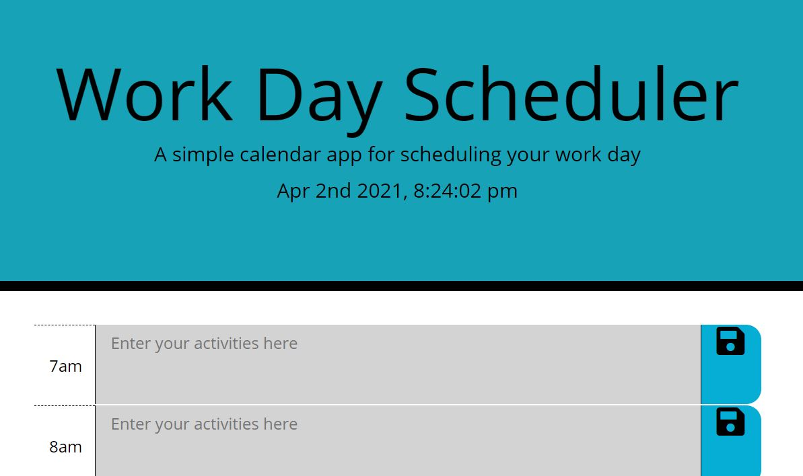

# 05 Third-Party APIs: Work Day Scheduler

## Your Task

A simple calendar application that allows a user to save events for each hour of the day by modifying starter code. This app will run in the browser and feature dynamically updated HTML and CSS powered by jQuery, with Moment.js for times.

## Built Using 

Moment.js, JQuery, BootStrap, JavaScript, CSS, HTMl 

## Link to live site 

https://jbolton89.github.io/TP-Web-API-s-Scheduler/

# Sample Image

